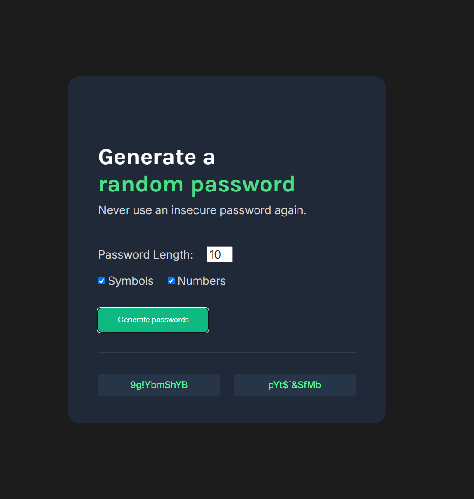

# 🔐 Password Generator

A sleek, responsive, and user-friendly password generator web application built with HTML, CSS and JavaScript. This project is part of the Scrimba Frontend Development Career Path.



## ✨ Features

* **Customizable Length:** Choose your desired password length (from 2 to 20 characters) with built-in input validation.
* **Toggle Options:** Easily include or exclude **Symbols** and **Numbers** using interactive checkboxes.
* **Dual Generation:** Generates two distinct random passwords simultaneously for quick comparison.
* **One-Click Copy:** Click on any generated password to instantly copy it to your clipboard using the modern Clipboard API.
* **Modern UI/UX:** Clean, dark-mode design with smooth interactive states and fully responsive layouts.

## 🛠️ Technologies Used

* **HTML5:** Semantic markup and structure.
* **CSS3:** Flexbox, custom properties, and modern styling techniques.
* **JavaScript (ES6+):** 
  * DOM Manipulation & Event Handling
  * ES6 Spread Operator (`...`)
  * Ternary Operators & Input Validation
  * Modern Clipboard API (`navigator.clipboard.writeText`)

## 🚀 Live Demo

Check out the live application here: 
👉 [Live Demo Link](https://password-generator-mohmusahm.netlify.app/)

## 📂 Project Structure

```text
password-generator/
│
├── index.html      # Main HTML structure
├── index.css       # Styling and layout design
└── index.js        # Core logic and interactivity
```
